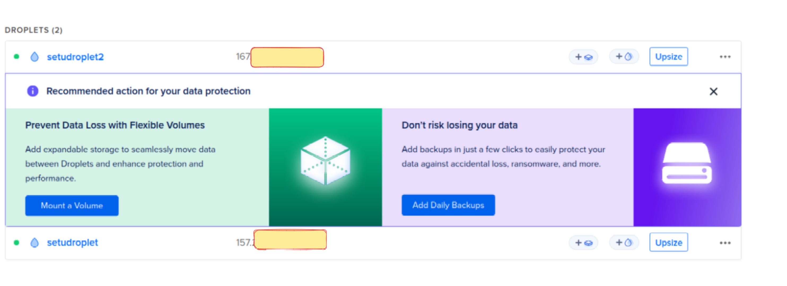

## About
- A browser-based KYC (Know Your Customer) module that validates the PAN and Bank Account of a customer.

### Flow
- Taking pan card number as input do a verification, If output is (success - pan card verified & bank account is LINKED), proceed to the next step.
- The request id we get from response of penny drop is used to fetch bank account details by the mock payment api and then verification is done by get details api.
- - a. we can confirm if the mock payment has gone through using following route: - backend-server/api/verify/ban/reverse/mock_payment/{requestId} -> This gives us the bank information on the beeceptor end point. 
- - b. get the bank & all details from endpoint - backend-server/api/verify/ban/reverse/{requestId} and compare result of the current and results of get details api call.

### Execution.

#### Frontend - frontend/
- react app
- ```npm i```
- ```npm run dev``` or ```npm run build``` and ```npm run preview```

#### Backend - backend/
- fast api
- create a virtual environment and then ```pip install -r requirements.txt```
- running from backend folder ```uvicorn app.main:app --reload```
- APIs.
  - http://127.0.0.1:8000/docs#/
- using ngrok for webhooks configuration.
- mysql db.
- docker compose file of each service in docker-compose.yml.

### Links
- Demo playlist: https://www.youtube.com/playlist?list=PLKsneWgsZjdE0LKaPm958kgKwdzzRnucr
- App deployment : 157.245.105.144:4173/


### Automatic Deployment
- Create token for creating a droplet on digital ocean (In my case using a droplet)
- Install doctl : https://docs.digitalocean.com/reference/doctl/how-to/install/
  - and execute commands to setup a token
  - Execute command to create a droplet: ```doctl compute droplet create --region blr1 --image ubuntu-24-04-x64 --size s-1vcpu-1gb <DROPLET-NAME>```
  - To delete : ```doctl compute droplet delete <DROPLET-ID>```
  - 